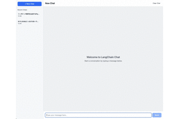

# LangChain RAG Chat Application

React + TypeScript + Viteフロントエンドとuv + FastAPI + LangChainバックエンドによるRAG対応チャットアプリケーション。

## 機能

### 基本チャット
- ストリーミングレスポンス
- LangChainによる会話履歴管理
- LocalStorageによる永続化
- サイドバー履歴表示
- OpenAI GPT-4o統合

### RAG機能
- RAGボット作成・管理
- ドキュメントアップロード（PDF、Markdown、Excel対応）
- ChromaDBベクトル検索
- 文書参照回答生成
- 自動文書処理・埋め込み生成



## アーキテクチャ

### バックエンド
- FastAPI（Python Webフレームワーク）
- LangChain（LLMフレームワーク）
- ChromaDB（ベクトルデータベース）
- OpenAI（言語・埋め込みモデル）

### フロントエンド
- React + TypeScript
- React Router
- Tailwind CSS
- Vite

## セットアップ

### 1. バックエンド

```bash
cd backend
uv sync
cp .env.example .env
# .envにOPENAI_API_KEYを設定
```

### 2. フロントエンド

```bash
cd frontend
npm install
```

## 実行

### バックエンド起動

```bash
cd backend
uv run python -m app.main
```

### フロントエンド起動

```bash
cd frontend
npm run dev
```

アプリケーションは http://localhost:5173 で動作。

## 使用方法

### RAGボット作成

1. RAG Botsタブを選択
2. + New Botをクリック
3. ボット名と説明を入力
4. ドキュメントをアップロード（PDF、Markdown、Excel対応）

### RAGボットチャット

1. Chatタブを選択
2. ボットセレクターでRAGボットまたは通常チャットを選択
3. チャット開始（RAGボットはアップロード文書を参照して回答）

### ドキュメント管理

- アップロード済みドキュメント一覧表示
- 処理統計表示（チャンク数、アップロード日時）
- 自動文書処理・埋め込み化

## 設定

`.env`ファイルでOpenAI API キーを設定：

```
OPENAI_API_KEY=your_openai_api_key_here
OPENAI_MODEL=gpt-4o
```

## API エンドポイント

### チャット
- `POST /chat/stream` - チャットストリーミング
- `GET /chat/history/{session_id}` - 会話履歴取得
- `DELETE /chat/history/{session_id}` - 会話履歴削除

### RAGボット管理
- `POST /bots` - RAGボット作成
- `GET /bots` - RAGボット一覧取得
- `GET /bots/{bot_id}` - ボット詳細取得
- `DELETE /bots/{bot_id}` - RAGボット削除
- `POST /bots/{bot_id}/documents` - ドキュメントアップロード

## データ保存

- チャットセッション: メモリ内（セッションベース）
- RAGボットメタデータ: `./data/bots/`内のJSONファイル
- ベクトル埋め込み: `./data/vector_db/`内のChromaDB
- ドキュメント処理: 一時ファイル（自動削除）
