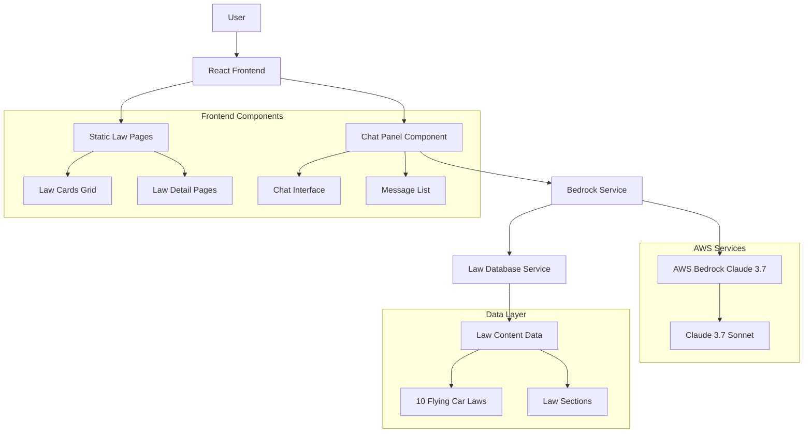

# Flying Car Law Information System

React application providing information about fictional flying car laws with AWS Bedrock LLM integration for interactive queries.

## Architecture



## Features

- Static information display for 10 fictional flying car laws
- Interactive chat interface in bottom-right corner
- AWS Bedrock integration with Claude 3.7 Sonnet model
- Law-specific responses with section references
- Auto-scrolling chat messages
- Navigation between law detail pages

## Technology Stack

- **Frontend**: React 18, TypeScript, Vite
- **Styling**: Direct CSS (no framework)
- **Icons**: Lucide React
- **LLM**: AWS Bedrock Claude 3.7 Sonnet
- **AWS SDK**: @aws-sdk/client-bedrock-runtime

## Setup

### Prerequisites

- Node.js 18 or higher
- AWS account with Bedrock access
- AWS IAM user with Bedrock permissions

### Installation

1. Install dependencies:
```bash
npm install
```

2. Configure environment:
```bash
cp .env.example .env
```

3. Edit `.env` with your AWS credentials:
```
VITE_AWS_REGION=us-east-1
VITE_AWS_ACCESS_KEY_ID=your_access_key_here
VITE_AWS_SECRET_ACCESS_KEY=your_secret_key_here
VITE_BEDROCK_MODEL_ID=us.anthropic.claude-3-7-sonnet-20250219-v1:0
```

### Development

```bash
npm run dev
```

Application runs on http://localhost:5173

### Build

```bash
npm run build
```

## Project Structure

```
src/
├── components/
│   └── ChatPanel.tsx          # Chat interface component
├── data/
│   └── lawContent.ts          # Flying car law definitions
├── services/
│   ├── bedrockService.ts      # AWS Bedrock integration
│   └── lawDatabase.ts         # Law database and prompt building
├── App.tsx                    # Main application component
└── App.css                    # Application styles
```

## Usage

1. Browse the 10 flying car laws on the main page
2. Click any law card to view detailed sections
3. Use the chat panel (bottom-right) to ask questions about the laws
4. Chat responses include relevant law section references
5. Click law references in chat to navigate to specific law pages

## AWS Bedrock Configuration

The application requires AWS Bedrock access with the Claude 3.7 Sonnet model. Ensure your AWS account has:

- Bedrock service access
- Model access for Claude 3.7 Sonnet
- IAM permissions for InvokeModel action

## Development Notes

- Chat state is isolated in ChatPanel component to prevent re-rendering issues
- All law content is centralized in lawContent.ts for maintainability
- Bedrock responses are parsed as JSON with fallback to plain text
- Auto-scroll functionality ensures latest messages are visible
