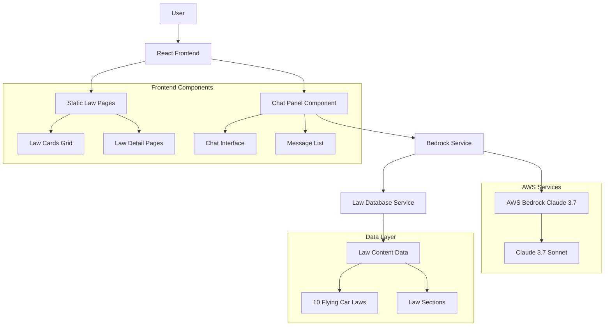

# 空飛ぶクルマ法律情報システム

## 概要

架空の空飛ぶクルマの法律に関する情報を提供するReactアプリケーション。AWS Bedrock LLM統合によるインタラクティブな質問応答機能を搭載。

### 機能

- 10の架空空飛ぶクルマ法律の静的情報表示
- 右下角のインタラクティブチャットインターフェース
- AWS Bedrock Claude 3.7 Sonnetモデル統合
- 法律条項参照付きの専門的回答
- チャットメッセージの自動スクロール
- 法律詳細ページ間のナビゲーション

## 使い方

1. メインページで10の空飛ぶクルマ法律を閲覧
2. 法律カードをクリックして詳細条項を表示
3. チャットパネル（右下）を使用して法律に関する質問
4. チャット回答には関連法律条項の参照が含まれる
5. チャット内の法律参照をクリックして該当法律ページへ移動

### セットアップ

#### 前提条件

- Node.js 18以上
- Bedrockアクセス権限付きAWSアカウント
- Bedrock権限付きAWS IAMユーザー

#### インストール

1. 依存関係のインストール:
```bash
npm install
```

2. 環境設定:
```bash
cp .env.example .env
```

3. AWS認証情報で`.env`を編集:
```
VITE_AWS_REGION=us-east-1
VITE_AWS_ACCESS_KEY_ID=your_access_key_here
VITE_AWS_SECRET_ACCESS_KEY=your_secret_key_here
VITE_BEDROCK_MODEL_ID=us.anthropic.claude-3-7-sonnet-20250219-v1:0
```

#### 開発

```bash
npm run dev
```

アプリケーションは http://localhost:5173 で実行されます。

#### ビルド

```bash
npm run build
```

## 技術的特徴

### 技術スタック

- **フロントエンド**: React 18, TypeScript, Vite
- **スタイリング**: 直接CSS（フレームワークなし）
- **アイコン**: Lucide React
- **LLM**: AWS Bedrock Claude 3.7 Sonnet
- **AWS SDK**: @aws-sdk/client-bedrock-runtime

### アーキテクチャ



### プロジェクト構造

```
src/
├── components/
│   └── ChatPanel.tsx          # チャットインターフェースコンポーネント
├── data/
│   └── lawContent.ts          # 空飛ぶクルマ法律定義
├── services/
│   ├── bedrockService.ts      # AWS Bedrock統合
│   └── lawDatabase.ts         # 法律データベースとプロンプト構築
├── App.tsx                    # メインアプリケーションコンポーネント
└── App.css                    # アプリケーションスタイル
```

### AWS Bedrock設定

アプリケーションはClaude 3.7 SonnetモデルでのAWS Bedrockアクセスが必要。AWSアカウントに以下が必要:

- Bedrockサービスアクセス
- Claude 3.7 Sonnetモデルアクセス
- InvokeModelアクションのIAM権限

### 開発上の注意点

- 再レンダリング問題防止のためChatPanelコンポーネントでチャット状態を分離
- 保守性のため全法律コンテンツをlawContent.tsに集約
- プレーンテキストフォールバック付きでBedrock応答をJSONとして解析
- 最新メッセージ表示確保のため自動スクロール機能実装
