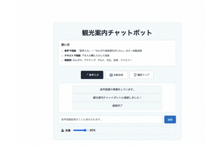

# 音声対話型観光案内チャットボット

Web Speech APIとAWS Pollyを活用した音声対話型の観光案内システム。

## 機能

- 音声認識によるテキスト入力（Web Speech API）
- 観光プランの自動提案（キーワード解析）
- 音声合成による回答読み上げ（AWS Polly）
- リアルタイム双方向通信（WebSocket）
- 送信タイミング制御（自動/手動切り替え）

## 動作イメージ



補足：実際には音声が可能で、ガイドも音声で応答します。

## 使い方

### 1. セットアップ
```bash
git clone <repository-url>
cd voice-chat
cd backend && uv sync
```

### 2. AWS設定
`.env`ファイルをbackendディレクトリに作成：
```
AWS_ACCESS_KEY_ID=your_access_key
AWS_SECRET_ACCESS_KEY=your_secret_key  
AWS_REGION=ap-northeast-1
```

### 3. 起動
```bash
# バックエンド（backendディレクトリから）
uv run uvicorn app.main:app --reload --host 0.0.0.0 --port 8000

# フロントエンド（別ターミナル、frontendディレクトリから）
python3 -m http.server 3000
```

### 4. アクセス
http://localhost:3000 をブラウザで開き、「接続」ボタンでWebSocket接続後、音声入力で観光相談が可能。

## 技術構成

### バックエンド
- **FastAPI**: WebSocketサーバー、HTTPエンドポイント
- **AWS Polly**: 音声合成サービス
- **uv**: パッケージ管理
- **pydantic-settings**: 設定管理

### フロントエンド  
- **HTML5/JavaScript**: Webクライアント
- **Web Speech API**: ブラウザネイティブ音声認識
- **WebSocket**: サーバーとの双方向通信

### アーキテクチャ特徴
- 音声認識と合成の分離設計
- テキストベースのWebSocket通信
- キーワード解析による旅行スタイル検出
- レイヤード構成（main.py, services/, core/）

## 開発・運用

### テスト・品質チェック
```bash
cd backend
uv run pytest          # テスト実行
uv run black app/       # コード整形
uv run mypy app/        # 型チェック
uv run flake8 app/      # リンティング
```

### AWS権限要件
IAMユーザーに`polly:SynthesizeSpeech`、`polly:DescribeVoices`権限が必要。

### 対応ブラウザ
Chrome、Edge、Safari（最新版）。HTTPSまたはlocalhostでのみ動作。
