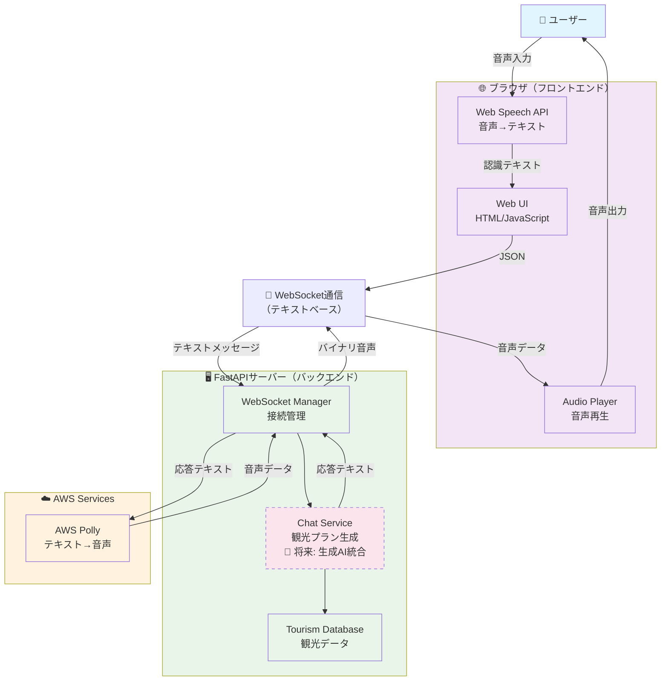

# システム構成図

## 概要

音声対話型観光案内チャットボットのハイレベルアーキテクチャ。音声処理の責務が明確に分離され、クライアント側音声認識とサーバー側音声合成の効率的な構成を実現。

## システム構成図

## アーキテクチャの特徴

### 🎯 責務の明確な分離

| 層 | 責務 | 技術 |
|---|---|---|
| **クライアント** | 音声認識・UI・音声再生 | Web Speech API, HTML5 Audio |
| **サーバー** | ビジネスロジック・データ管理 | FastAPI, WebSocket |
| **AWS** | 音声合成 | AWS Polly |

### 🔄 データフロー

1. **音声入力**: ユーザー → Web Speech API → テキスト
2. **テキスト通信**: フロントエンド ⟷ バックエンド（WebSocket）
3. **プラン生成**: Chat Service → Tourism Database
4. **音声合成**: 応答テキスト → AWS Polly → 音声データ
5. **音声出力**: 音声データ → Audio Player → ユーザー

### 💡 設計の利点

- **低レイテンシ**: 音声認識がローカル処理
- **プライバシー**: 音声データがサーバーに送信されない
- **スケーラビリティ**: 音声処理負荷の分散
- **拡張性**: 生成AI統合の準備完了
- **マルチプラットフォーム対応**: 各デバイスのネイティブ音声認識活用可能

### 🚀 将来の拡張

- **Chat Service**: LangChain統合による生成AI対応
- **マルチプラットフォーム**: iOS（Speech Framework）、Android（SpeechRecognizer API）
- **多言語対応**: 各プラットフォームの言語機能活用

## 技術詳細

詳細な実装仕様は [CLAUDE.md](../CLAUDE.md) を参照してください。